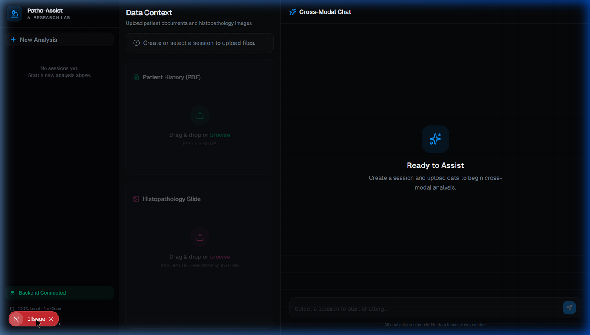

# Patho-Assist AI 🔬🧠


> **A 100% secure, offline, cross-modal AI assistant for edge-hardware medical research.**

<p align="center">
  
</p>

## 📖 Overview

**Patho-Assist AI** is a professional-grade, locally hosted AI dashboard designed for medical researchers. Processing sensitive medical data requires strict adherence to privacy—therefore, this entire application runs **100% offline via local LLMs and embedded vector databases**. No patient documents or histopathology slides ever leave the host machine.

The application pioneers **Cross-Modal RAG** (Retrieval-Augmented Generation):
1. **Document Ingestion:** Researchers upload Patient History PDFs, which are chunked, semantically embedded, and stored in a local vector database.
2. **Vision Analysis:** Researchers upload histopathology images, which are analyzed by a local vision-language model to identify cellular anomalies and tissue architecture.
3. **Reasoning Synthesis:** A reasoning LLM fuses the retrieved PDF evidence with the vision-model's microscopic findings to answer complex clinical queries in real-time.

---

## ⚡ The 16GB RAM Architecture (Strict Memory Swapping)

Running multiple heavy AI models (Vision + Reasoning + Embeddings) typically requires massive VRAM or cloud infrastructure. **Patho-Assist AI was specifically architected to run on edge hardware constrained to 16GB of shared RAM.**

To achieve this without out-of-memory (OOM) crashes, the underlying FastAPI backend utilizes **Explicit Model Swapping** via a custom **Triple-Layer Eviction Strategy**:

1. **Defensive Eviction (`/api/ps` Check):** Before any task, the engine scans the Ollama memory allocator. Any lingering models are preemptively unloaded.
2. **Just-In-Time (JIT) Loading:** The required model (e.g., `paligemma` for vision, `gemma2:2b` for text) is loaded strictly for the duration of the inference stream.
3. **Auto-Eviction (`keep_alive: 0`):** The LLM API requests are sent with a strict zero-second retention policy. The exact millisecond the inference stream concludes, the memory is purged, returning the GPU/RAM completely to the OS.

**Why this matters:** This orchestration allows asynchronous processing of cross-modal data on commercial laptops. A 3GB vision model can analyze an image, dump its text findings into the session state, gracefully exit RAM, and instantly make way for a 1.5GB reasoning model to synthesize the final response—guaranteeing stable, sequential execution.

---

## ☁️ Hybrid Mode: The Llama API Cloud Integration

While local mode ensures strict data privacy, Patho-Assist AI can be instantly switched to **Cloud Mode** for high-throughput, state-of-the-art inference. This is controlled entirely by the `RUNTIME_MODE` configuration.

When `RUNTIME_MODE="cloud"`, the application bypasses Ollama completely and offloads tasks via the official `llama-api-client` SDK:
1. **Cloud Vision:** Routes histopathology images (as base64 Data URIs) to Meta's **Llama 4 Maverick (17B)** multimodal model.
2. **Cloud Reasoning:** Routes the RAG context and visual findings to **Llama 3.3 70B Instruct** for incredibly deep, rapid clinical correlation. 

This hybrid architecture proofs the project for both secure edge-hardware deployments and scalable SaaS (e.g., deploying the frontend to Vercel and pointing it to a cloud-mode backend). 


## 🛠️ Tech Stack

### Frontend (User Interface)
* **Framework:** Next.js 16 (App Router)
* **Styling:** Tailwind CSS v4 + Custom Medical-SaaS Dark Theme (`globals.css`)
* **Components:** shadcn/ui & Lucide React
* **UX Engineering:** Asynchronous polling, drag-and-drop zones, and latency-masking model-swap indicators.

### Backend (Orchestration & RAG)
* **Framework:** FastAPI + Python 3.10+
* **Vector DB:** ChromaDB (Embedded In-memory/On-disk)
* **Orchestration:** LangChain (RecursiveCharacterTextSplitter)
* **Async Requests:** Official `ollama` Python SDK for non-blocking local model communication

### AI Models (Local Execution via Ollama)
* **Vision / Histopathology:** `llava` (LLaVA — Large Language and Vision Assistant, ~4.7 GB)
* **Reasoning / Chat:** `gemma2:2b` (Highly efficient 2B parameter LLM, ~1.6 GB)
* **Embeddings:** `all-MiniLM-L6-v2` (`sentence-transformers`, ~80MB, runs effortlessly in background RAM)

---

## 🚀 Local Setup Guide

Follow these steps to securely configure the offline environment on your local machine.

### 1. Requirements Installation

First, clone the repository and set up your Python backend:

```bash
cd patho-assist-ai/backend
python -m venv venv
# Windows:
venv\Scripts\activate
# Linux/Mac:
source venv/bin/activate

pip install -r requirements.txt
```

Set up the frontend:

```bash
cd ../frontend
npm install
```

### 2. Install and Pull Local AI Models (Ollama)

You must install [Ollama](https://ollama.com/) to serve the models locally. Once Ollama is running in the background, download the specific models used by the system:

```bash
# Pull the Histopathology Vision Model
ollama pull llava

# Pull the Cross-Modal Reasoning Text Model
ollama pull gemma2:2b
```

**Option B: Cloud Mode (High Performance)**
* Set `RUNTIME_MODE="cloud"`
* Get an API Key from [Meta Llama Developer Platform](https://llama.developer.meta.com/).
* Add your key to the `.env` file: `LLAMA_API_KEY="your-key-here"`.
* *(No local GPU or Ollama installation required).*

*(Note: The embedding model `all-MiniLM-L6-v2` for RAG will always run locally and is downloaded automatically by HuggingFace the first time you run the backend).*

### 3. Boot the FastAPI Backend

Ensure your virtual environment is activated, then boot the API layer:

```bash
cd backend
uvicorn main:app --reload
```
You should see: `  All systems ready — accepting requests  `

### 4. Run the Next.js Frontend Dashboard

In a new terminal window, start the frontend development server:

```bash
cd frontend
npm run dev
```

Navigate to [http://localhost:3000](http://localhost:3000) in your browser. Start a new session, drag-and-drop your patient PDF and histopathology slide, and begin your cross-modal RAG analysis securely on your edge device.
